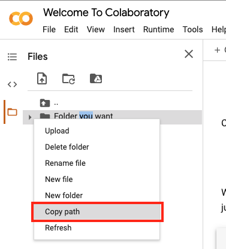

# Using `git` on Google Drive

## Introduction

When you use Google Colaboratory notebooks each notebook autosaves every couple minutes. You can always go back to the last 100 autosaves of the notebook. This is around 3 hours of when you open up the notebook.

What if you did more than 3 hours of work on it and the notebook crashes or stops working? How to you get your notebook back to the state where you started at the beginning of the day?

If you want to do this, you're better off turning your Google Drive folder into a local git repository.

**Why not just use the GitHub integration that Google Colaboratory notebook has?**

The current integration is able to save a copy of your Colaboratory notebook to a GitHub repo as a commit. It won't be able to commit other files, such as data file or pickle file, along with the notebook in order for it to run. The only way to go around this it to download all the needed file onto your local computer, then push it to GitHub. What a hassle.

In this tutorial, we are going to interact with git and GitHub through Google Drive.

## Goal

You'll need to know basic git command line & how to use the terminal functions within a Colaboratory notebook to follow this tutorial.

In this tutorial, you are going to be doing the following:
* [Getting a Personal Access Token from GitHub](#getting-a-personal-access-token-from-github)
* [Cloning a GitHub repository](#cloning-github-repo)
* [Initializing a local git repository in Google Drive Folder](#intializing-a-local-git-repo-in-google-drive-folder)
* [Pushing local git repository from Google Drive to Remote Repository on GitHub](#pushing-local-git-repo-to-remote-repogithub)

Generally, Terminal or Command Line is used when cloning GitHub repositories or making a local git repository. In this tutorial,  another Colaboratory notebook within your Google Drive will be used as your terminal.

**Note**: Repository is going to be shorten to repo from now on.

## Getting a Personal Access Token from GitHub

It won't prompt for GitHub account's password when using Colaboratory notebook as the terminal. A personal access token is necessary to prove your account has access to the a repo.

Follow the instructions from this [link](https://docs.github.com/en/github/authenticating-to-github/creating-a-personal-access-token) to get one.

**Note**: Remember to treat this access token like you would treat any other password.

## Cloning GitHub Repo

As mention before, the prompt to enter the password won't pop up when using Colaboratory Notebooks to interact with GitHub. The personal access token is needed when pushing commits to the Github repo.

The personal access token that we got [above](#getting-a-personal-access-token-from-github) will be used.

1. Go to the folder where you want the cloned repo and create a new Colaboratory notebook. Name the notebook `terminal.ipynb`.

2. Mount Google Drive to to your  `terminal.ipynb` notebook. This will allow the notebook to access your Google Drive.

```python
from google.colab import drive
drive.mount('/content/drive')
```

This will prompt you to authorize to mounting your Google Drive to your notebook. Make sure you copy and paste in your authorization code from the website to your notebook.

See [this](https://www.marktechpost.com/2019/06/07/how-to-connect-google-colab-with-google-drive/) for more details.

3. In the Colaboratory notebook, unhide the menu on the left hand side. Find the folder where you want the new cloned repo to live in and copy the file path for it. 



Once you `cd` into this folder, you can clone the repo.

```bash
%cd [paste folder path that you copied here]
```
Double check that you are in the folder that you want to clone the repo into by using the following command.

```bash
pwd
```

4. Copy the HTTPS of the GitHub repo.

On the GitHub repository page look for a green button that says **Clone or download** on the right hand side of the page.


It should be in the following format:

```
https://github.com/[User name]/[repository name].git
```

5. Edit the Github Repo's HTTPS to include the personal access token that you gotten [above](#getting-a-personal-access-token-from-github).

It should look like this:

```
https://[github-token]@github.com/[User name]/[repository name].git
```

6. Now clone run the command to clone the GitHub repo.

```
git clone https://[github-token]@github.com/[User name]/[repository name].git
```

You now have a cloned repo in your Google Drive!

---

>To double check that the the repo has cloned either:
>
> Run the following command in terminal to see if the GitHub repo name pop ups as a folder.
> 
> ```bash
> !ls
> ```
>It should output the GitHub repo name as a folder in your current folder.
> 
>
>
> **OR**
> 
> Refresh your Google Drive page. Go into the folder that you `cd` into earlier. Check if the the GitHub repo is now listed in the folder.

## Intializing a Local Git Repo in Google Drive Folder

These are the steps to initializing a Google Drive folder into a local git repo.

1. Open another Colaboratory notebook outside the folder you want to make into a local git repo. Name the notebook `terminal.ipynb`

**Note:** I'd say to keep the notebook outside the folder in question, so you don't upload it with your personal access token to GitHub. Another method is to start your notebook inside the folder in question and add `terminal.ipynb` to the `.gitignore` file.

2. Mount the the Google Drive into the notebook.
```python
from google.colab import drive
drive.mount('/content/drive')
```
This will prompt you to authorize to mount your Google Drive. Make sure you do that and enter in your authorization code from the website.

3. Open file menu within the Colaboratory notebook, click on the folder you want to turn into a local git repo. Copy the file path.


In another cell, put in the following function.

```bash
%cd [paste in file path here. Put in quotes if there are spaces in it.]
```

Double check that you're in the right repository using `pwd`.

4. Now you're ready to initialize the folder into the local git repository.

```bash
!git init
```

You can double check that it's been initialize by the following methods:

- Checking by using `!git status`

You want it to output to start with this:
```
 On branch master
...
```

If the output is this:
```
 fatal: not a git repository (or any of the parent directories): .git
```
Re-run `!git init`.

**OR**

- Go to your folder within your Google Drive, refresh the page & see if there's a `.git` folder in it.

5. Config git to make commits in the folder.

**Note:** You'll need to recreate your git config file everytime you restart the terminal.

```bash
!git config --global user.name [your username]
!git config --global user.email [your email address]
```
Now you're read to make make git commits within the folder!

## Pushing Local Git Repo to Remote Repo(Github)

1. Create a new repo in your GitHub account.

2. Copy the HTTPS of your GitHub repo & add your GitHub personal access token into it.

```
https://[github-personal-token]@github.com/[User name]/[repository name].git
```

3. Use the edited HTTPS to create a git remote for the github repo.

```bash
!git remote add [alias] https://[github-token]@github.com/[User name]/[repository name].git
```
**Note:** The common alias is `origin` for remotes is origin.

Double check that the remote is added with the following.

```bash
!git remote -v
```

`-v` means to output more information regarding the remote.

The output of this should be:

```
[alias] https://[github-token]@github.com/[User name]/[repository name].git (fetch)
[alias] https://[github-token]@github.com/[User name]/[repository name].git (push)
```

5. Push your local repo into your github repo.

```bash
!git push -u [ alias] [branch you want to push to on Github]
```

Tada! You're good to go!

## Recap

In order to clone a Github repo into Google Drive or push a local git repo from Google Drive, you need the following:
* A Colaboratory notebook with the Google Drive mounted
* Personal access token from your GitHub account
* GitHub repo HTTPS

The GitHub repo needs to be refigured in the following format:
```
https://[github-token]@github.com/[User name]/[repository name].git
```

From there, you can either use it to `git clone` a Github repository or use `git remote` to link it to a Github repository.


## References

* [Link](https://zerowithdot.com/colab-github-workflow/)
* [Github Cloning Repo Tutorial](https://docs.github.com/en/github/creating-cloning-and-archiving-repositories/cloning-a-repository)
