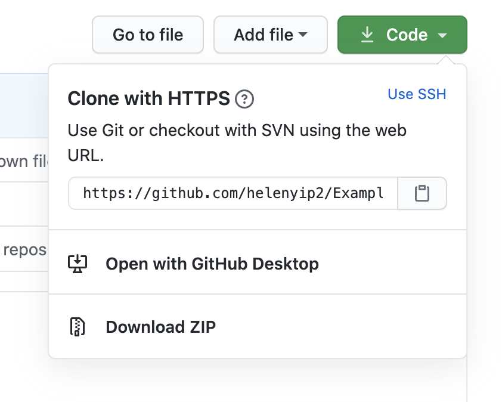
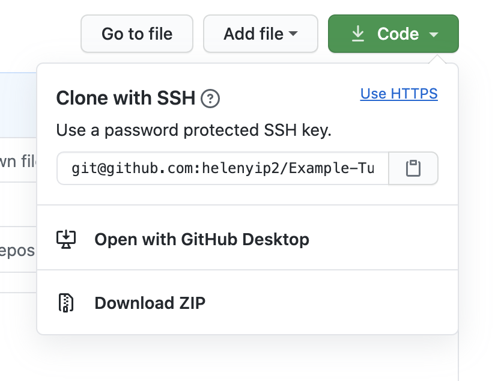
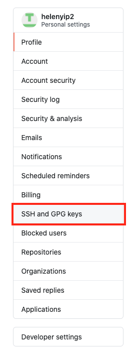

# How to use SSH with GitHub

The goal of this tutorial to show how to set up your computer and GitHub account so you can use SSH to access GitHub. It is written for Linux.

* [Introduction](#introduction)
* [What is SSH?](#what-is-ssh)
* [How to use SSH with GitHub?](#how-to-use-ssh-with-github)
    * [Creating Public and Private SSH Keys](#creating-public-and-private-ssh-keys)
    * [Adding Private SSH Key to `ssh-agent`](#adding-private-ssh-key-to-ssh-agent)
    * [Add Public SSH Key to GitHub account](#add-public-ssh-key-to-github-account)
* [SSH into another computer?](#ssh-into-another-computer)
* [References](#references)

## Intoduction

There are 2 options available when trying to clone a GitHub repository.

**1. Clone with HTTPS**




These are available on all public and private GitHub repositories. This is what you've used before when cloning a repository from GitHub.

When using this method, the git remote saved in your local git repository will be in the following format. (I'm using this current GitHub repository as an example.)
```
https://github.com/helenyip2/Example-Tutorials.git
```
This method will prompt for your GitHub username and password every time you interact with the remote repo on GitHub. Commands that will interact with the remote repo includes the following:
* `git clone`
* `git fetch`
* `git pull`
* `git push`

**2. Clone with SSH**



When using the SSH URL you'll be connecting to GitHub via SSH. A SSH key needs to registered with your GitHub account to use this method. We will go into this later.

The git remote saved will be in the following format when SSH is used. (I'm using this currently GitHub repository as an example.)
```
git@github.com:helenyip2/Example-Tutorials.git
```
You'll not be prompted to enter your GitHub username and password when interacting with the remote repo. This is because GitHub already knows that who you are because of the SSH key registered with the account.

## What is SSH?

SSH is a communication protocol standing for Secure Shell. It allows you to access a remote computer while on your local computer. The traffic travelling back and forth between 2 computers is encrypted. It is often used in terminal or command line. In the case of this tutorial:
* Local Computer = the computer you are on
* Remote Computer = GitHub

When you're using SSH, you'll need an SSH client on your local computer to remote into another computer (GitHub). The computer you're trying to remote into needs to have a SSHD running on it. SSHD is an OpenSSH server that listens to incoming connections using SSH protocols and acts as server.

A pair of SSH keys, private and public keys needs to be created using the SSH client on your local computer. The private SSH key is added to the ssh-agent on your local computer. The public key is added to SSHD server (GitHub) of where you want to SSH into.

The **public key** on the server will encrypt any data that is sent to it to the local computer. The encrypted data only decrypted by the **private key**. This ensure that the remote computer is only access by people who have permission to do so.

## How to use SSH with GitHub?

If you want to use SSH with GitHub you'll need to setup a couple things.

Your local computer will be the SSH client. This is where you'll be creating the private and public SSH keys. GitHub will be the SSHD server of where you're trying to remote access into. 

>**Should I create a new key if I already have one on my computer already?**
> 
> Are you already using this key? If so, create a new one! It is better to create a new SSH for every computer or thing you're trying to SSH into.

### Creating Public and Private SSH Keys
---
Open up command line on your computer. You'll need to use `ssh-keygen` to create your SSH Keys.

```bash
ssh-keygen -t rsa -b 4096
```
`-t rsa` - This specify the type of key you want to create. In this case  it's a `rsa` type. This is the default type of SSH key created.

`-b 4096` - This means that the key created is 4096 bits. This is recommended by [GitHub](https://help.github.com/en/github/authenticating-to-github/generating-a-new-ssh-key-and-adding-it-to-the-ssh-agent). If this is not specified, the default will be 2048 bits.

Next you'll be prompted to for where to save the key. Keep the location of the keys to what the it recommends. Change the name of the key from `id_rsa` to `id_rsa_github`. This way you know exactly what the keys are used for.

You'll be prompted next to enter in a passphrase. The passphrase is another layer of security added onto the private SSH key and is optional. The terminal will prompt the entry of the passphrase to use the private SSH key if a passphrase added here. Information sent over from the remote computer will not be decrypted without passphrase (if this is set up).  

The private key will be `id_rsa_github`.
The public key will be `id_rsa_github.pub`.

### Adding Private SSH Key to `ssh-agent`
---
Congratulations you've now created the SSH keys! Now what?

Something is still needed to interface between the local computer and remote computer. This is where `ssh-agent` comes in. The `ssh-agent` helps you manage all your different SSH keys. 

You'll need to add the private key to the ssh-agent. For more information on this click [here](https://help.github.com/en/github/authenticating-to-github/generating-a-new-ssh-key-and-adding-it-to-the-ssh-agent#adding-your-ssh-key-to-the-ssh-agent). 

The gist of it is the following command:
```bash
ssh-add <ssh key folder path>/id_rsa_github
```
**Note:** Remember to add the **private key** here (The file without the `.pub` extension) and not the public key.

### Add Public SSH Key to GitHub account
---
One last step before you're read to use SSH to interact with your GitHub repos instead of HTTPS.

In your browser go onto your GitHub account and go into your **Settings**.


In your setting selection the **SSH & GPG Keys**.



Click add a new SSH key.


On your computer open up your `id_rsa_github.pub` file and copy and paste that into GitHub.

**Note:** Remember to use your **public key** `id_rsa_github.pub` file and not the private one!

Now you're ready to use SSH to access GitHub!

## Extra: SSH into another computer?

If you were using this to SSH into another computer, you would add the public key to the `authorized_key` file onto the SSHD server computer. Watch [this](https://youtu.be/hQWRp-FdTpc?t=2040) for more information.

## References
* https://help.github.com/en/github/using-git/which-remote-url-should-i-use
* https://help.github.com/en/github/authenticating-to-github/about-ssh
* https://help.github.com/en/github/authenticating-to-github/generating-a-new-ssh-key-and-adding-it-to-the-ssh-agent
* https://youtu.be/hQWRp-FdTpc
* https://www.ssh.com/ssh/public-key-authentication

