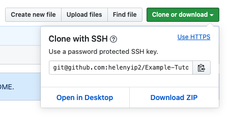

# How to use SSH with Github

When you're trying to clone a GitHub repository into your you see that there's 2 different options when you click on the on the green Clone or download button.

1. Clone with HTTPS


These are available on all public and private Github reposoitories. This is probably what you've used before when you've clone a repository from Github.

When you use this method, the remote that's saved in your local git repository will be in the following format. I'm using this current Github repository as an example.
```
https://github.com/helenyip2/Example-Tutorials.git
```

Every time you use the commands listed below in command line, you'll be prompted to enter in your Github username and your password.
* `git clone`
* `git fetch`
* `git pull`
* `git push`

2. Clone with SSH



When you're using the SSH URL you'll be GitHub via SSH. In order to do this, you'll need to have a SSH key registered with your GitHub account. We will go into this later.

When you use this method, the Git remote that's saved in your local git repository will be in the following format. I'm using this currently Github repository as an example.
```
git@github.com:helenyip2/Example-Tutorials.git
```

When you access GitHub via SSH, you'll not be prompted to enter your GitHub username and password every time you use the following commands:
* `git clone`
* `git fetch`
* `git pull`
* `git push`

This is because GitHub already knows that who you are because of the SSH key registered with the account.

## What is SSH?

SSH is a communication protocol standing for Secure Shell. It is a way that lets you do anything on a remote computer. The traffic travelling back and forth is encrypted. It is most oftenly used in terminal or command line.

When you're using SSH, you'll in an SSH client for you to remote into another computer. The computer you're trying to remote into needs to have a SSHD running on it. SSHD is an OpenSSH server that listens to incomming conenctions using SSH protocols and acts as server for the protcol.

On the SSH client, a ssh private and public key is created.
The private SSH key will be added to the ssh-agent on your local computer. The public key is added to SSHD server of where you want to SSH into.

## How to use it with Github?

If you want to utilize SSH with Github you'll need to setup a couple things.

Your computer will be the SSH client. Github will be the SSHD server of where you're trying toThis is where you'll be creating the private and public SSH keys.

>**Should I create a new key if I already have one on my computer already?**
> 
> Are you already using this key? If so, create a new one! It is better to create a new SSH for every computer or thing you're trying to SSH into.

### Creating Public and Private SSH Keys

Open up command line on your computer. You'll need to use `ssh-keygen` to create your SSH Keys.

```bash
ssh-keygen -t rsa -b 4096
```
`-t rsa` - This specify the type of key you want to create. In this case  it's a `rsa` type. This is the default type of SSH key created.

`-b 4096` - This means that the key created is 4096 bits. This is what is recommended by [Github](https://help.github.com/en/github/authenticating-to-github/generating-a-new-ssh-key-and-adding-it-to-the-ssh-agent). If this is not specified, the default will be 2048 bit.s

Next you'll be prompted to for where to save the key. I'd recommend keeping the folder that it recommends, but change the name of the key from `id_rsa` to `id_rsa_github`. This way you know exactly what this is used for.

You'll be prompted next to enter in a passphrase. This is for if someone can get into your computer, if they want to SSH into somewhere else, they still need the passphrase in order to use the SSH key.

The private key will be `id_rsa_github`.
The public key will be `id_rsa_github.pub`.

### Adding Private SSH Key to `ssh-agent`

Congratulations you've now created the SSH keys! Now what?

Well you'll still need something to interface between you and the computer or thing you're supposed to be ssh-ing into. This is where `ssh-agent` comes in. The ssh-agent helps you manage all your differen keys. 

You'll need to add the private key to the ssh-agent. For more information on this click [here](https://help.github.com/en/github/authenticating-to-github/generating-a-new-ssh-key-and-adding-it-to-the-ssh-agent#adding-your-ssh-key-to-the-ssh-agent). 

The gist of it is the following command in command line:
```bash
ssh-add <ssh key folder path>/id_rsa_github
```
**Note:** Remember to add the **private key** here and not the public key.

### Add Public SSH Key to GitHub account

In your browser go onto your Github account and go into your **Settings**.

In your setting selection the **SSH & GPG Keys**.

Click add a new SSH key.

On your computer open up your `id_rsa_github.pub` file and copy and paste that into GitHub.

**Note:** Remember to use your **public key** `id_rsa_github.pub` file and not the private one!

Now you're ready to use SSH to access Github!

## How is this different if I was using this to SSH into another computer.

If you were using this to SSH into another computer, you would add the public key to the `authorized_key` file onto the SSHD server computer. Watch [this](https://youtu.be/hQWRp-FdTpc?t=2040) for more information. 


## References
* https://help.github.com/en/github/using-git/which-remote-url-should-i-use
* https://help.github.com/en/github/authenticating-to-github/about-ssh
* https://help.github.com/en/github/authenticating-to-github/generating-a-new-ssh-key-and-adding-it-to-the-ssh-agent
* https://youtu.be/hQWRp-FdTpc

