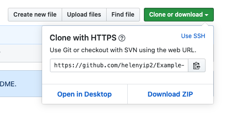

# How to use SSH with Github

When you're trying to clone a GitHub repository into your you see that there's 2 different options when you click on the on the green Clone or download button.

1. Clone with HTTPS


These are available on all public and private Github reposoitories. This is probably what you've used before when you've clone a repository from Github.

When you use this method, the remote that's saved in your local git repository is in the following format. I'm using this current Github repository as an example.
```
https://github.com/helenyip2/Example-Tutorials.git
```

Every time you use the commands listed below in command line, you'll be prompted to enter in your Github username and your password.
* `git clone`
* `git fetch`
* `git pull`
* `git push`

2. Clone with SSH

SSH is a communication protocol standing for Secure Shell.

## What is SSH?

## How to use it with Github?

